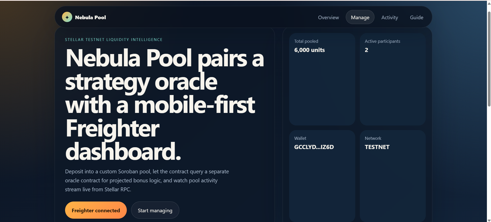
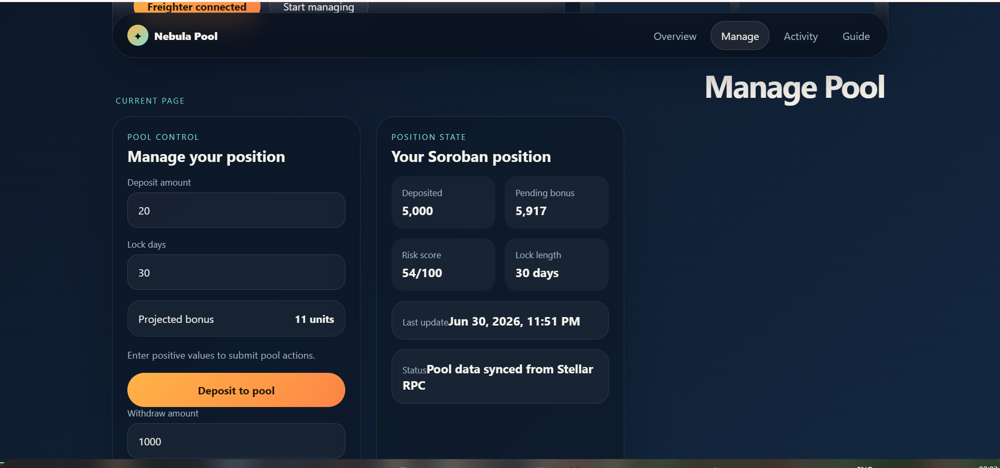
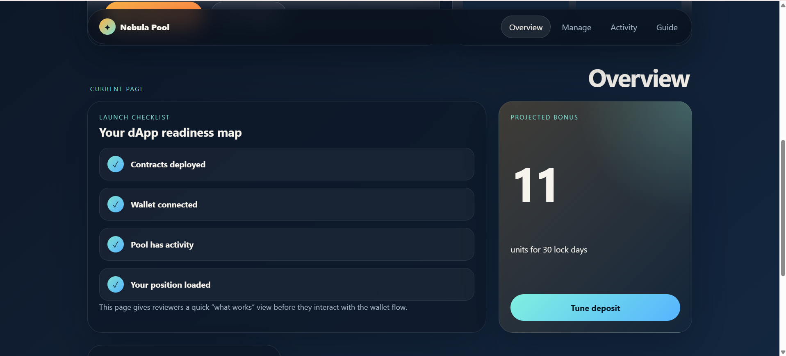
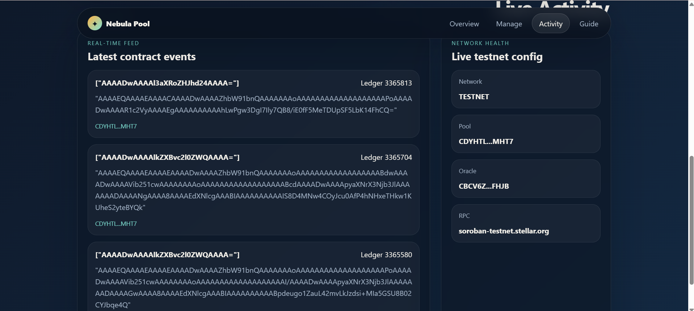
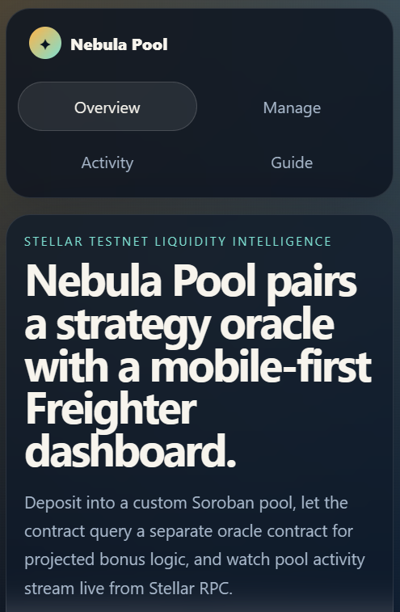
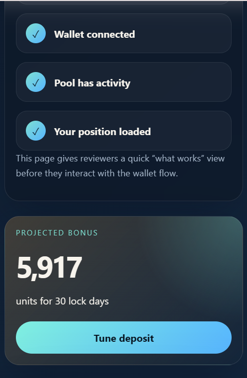
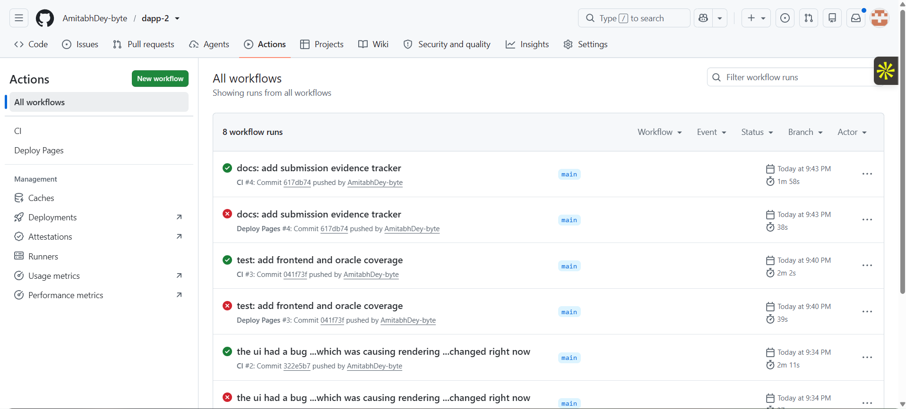
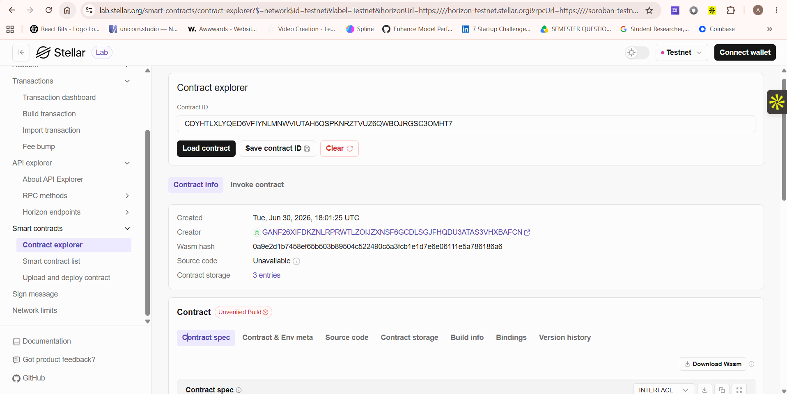

# Nebula Pool

[](https://github.com/AmitabhDey-byte/dapp-2/actions/workflows/ci.yml)
[](https://github.com/AmitabhDey-byte/dapp-2/actions/workflows/deploy-pages.yml)

Nebula Pool is an advanced Stellar testnet dApp that demonstrates production-style Soroban smart contracts, inter-contract communication, wallet signing, real-time RPC event streaming, CI/CD, responsive UI, and an optional Gemini-powered strategy copilot.

The project is designed as a full-stack Web3 submission: not just a contract demo, but a deployed user-facing application with documentation, tests, screenshots, and contract interaction evidence.

## Live Links

- GitHub repository: [AmitabhDey-byte/dapp-2](https://github.com/AmitabhDey-byte/dapp-2)
- GitHub Pages: [https://amitabhdey-byte.github.io/dapp-2/](https://amitabhdey-byte.github.io/dapp-2/)
- Submission evidence: [`docs/submission-evidence.md`](docs/submission-evidence.md)
- Vercel deployment: [https://dapp-2-pearl.vercel.app/](https://dapp-2-pearl.vercel.app/)
- Demo video: [Google Drive walkthrough](https://drive.google.com/file/d/1pJuuivnpNuMHSTpO_oAM7yRZZfNzAVt8/view?usp=sharing)

## Preview

### Desktop Dashboard



### Manage Position



### Overview Analytics



### Contract Activity Feed



### Mobile Responsive UI





### CI/CD Evidence



### Contract Explorer Evidence



## What Nebula Pool Does

Nebula Pool behaves like a simplified DeFi staking/liquidity dashboard:

1. A user connects a Freighter wallet.
2. The frontend reads pool state from Stellar testnet.
3. The user enters a deposit amount and lock duration.
4. The pool contract calls a separate strategy oracle contract.
5. The oracle returns projected bonus and risk score data.
6. The pool stores the user position and emits events.
7. The frontend streams recent contract activity from Stellar RPC.
8. The optional Gemini advisor explains the position in plain English.

## Feature Highlights

- Advanced Soroban contract architecture
- Inter-contract communication between pool and oracle
- Freighter wallet connection and transaction signing
- Deposit, withdraw, refresh, and position tracking flows
- Real-time contract event feed from Stellar RPC
- Strategy/risk analytics dashboard
- Optional Gemini AI strategy copilot via Vercel serverless route
- Mobile responsive multi-page UI
- Loading states, disabled states, and error handling
- GitHub Actions CI/CD
- Vercel-compatible frontend deployment
- Tests for frontend utilities and Soroban contracts

## Architecture

```text
Freighter Wallet
      |
      v
React + Vite Frontend
      |
      |-- reads pool stats, positions, and events
      |-- submits signed transactions
      |-- calls /api/gemini for optional AI summaries
      v
Stellar RPC / Soroban
      |
      |-- liquidity-pool contract
      |       |-- deposit
      |       |-- withdraw
      |       |-- refresh
      |       |-- position
      |
      |-- strategy-oracle contract
              |-- projected_bonus
              |-- risk_score
              |-- set_tier
```

## Smart Contracts

### `strategy-oracle`

Located at [`contracts/strategy-oracle`](contracts/strategy-oracle).

- Stores tiered APR-style bonus logic
- Calculates projected bonus from deposit amount and lock duration
- Returns a risk score used by the pool
- Supports admin-managed tier updates
- Emits tier update events

### `liquidity-pool`

Located at [`contracts/liquidity-pool`](contracts/liquidity-pool).

- Stores user pool positions
- Calls the oracle contract during deposit and refresh
- Tracks total deposits and participant count
- Supports deposit, withdraw, refresh, position, and stats methods
- Emits deposit, withdraw, and refresh events

## Deployment Evidence

Network: Stellar testnet

| Item | Value |
| --- | --- |
| Oracle contract | `CBCV6ZC2XNLPPL2KIO5TQ7Z4BJ4MYCFVXIFG4O5ZZ56JEPHTHUC6FHJB` |
| Pool contract | `CDYHTLXLYQED6VFIYNLMNWVIUTAH5QSPKNRZTVUZ6QWBOJRGSC3OMHT7` |
| Oracle deploy tx | `36b419deb136149bf555ed8e35cc30d1a17993efe64afaff98977024d57ed701` |
| Oracle init tx | `8c27cc5ae3ad4f99f7973eacdd12905f03c4fa2be39b8a634201b7ff4cb81e04` |
| Pool deploy tx | `d4e86fc4c54fdeaa5bcc5322fb0c5873dba5baa288e61b0a22ff957193a335da` |
| Pool init tx | `8d81534305c935b90d5bd0516142e241f240f3a26c74856036aab188f812def7` |
| Example deposit tx | `c2a7078981cb791961d9c2b4d83c92e988fd6b39102ca1d27ce2046fc00fa527` |

## Local Setup

### Prerequisites

- Node.js 22+
- npm 11+
- Rust stable
- Stellar CLI
- Freighter wallet browser extension

### Install

```bash
npm install
```

### Environment

Copy `.env.example` to `.env`.

```bash
VITE_STELLAR_NETWORK=TESTNET
VITE_STELLAR_RPC_URL=https://soroban-testnet.stellar.org
VITE_STELLAR_HORIZON_URL=https://horizon-testnet.stellar.org
VITE_STELLAR_NETWORK_PASSPHRASE=Test SDF Network ; September 2015
VITE_POOL_LABEL=Nebula Pool
VITE_POOL_CONTRACT_ID=CDYHTLXLYQED6VFIYNLMNWVIUTAH5QSPKNRZTVUZ6QWBOJRGSC3OMHT7
VITE_ORACLE_CONTRACT_ID=CBCV6ZC2XNLPPL2KIO5TQ7Z4BJ4MYCFVXIFG4O5ZZ56JEPHTHUC6FHJB
GEMINI_API_KEY=your_server_side_key
GEMINI_MODEL=gemini-2.5-flash
```

Never expose `GEMINI_API_KEY` as a `VITE_` variable. It is used only by the serverless route at [`api/gemini.ts`](api/gemini.ts).

### Run Frontend

```bash
npm run dev
```

### Build Frontend

```bash
npm run build
```

### Run Frontend Tests

```bash
npm run frontend:test
```

### Run Contract Tests

```bash
npm run contracts:test
```

### Run Full Check

```bash
npm run check
```

## Vercel Deployment

Use Vercel for the hosted frontend and Gemini serverless function.

Recommended settings:

- Root directory: `.`
- Framework preset: `Vite`
- Build command: `npm run build`
- Output directory: `dist`

Add these environment variables in Vercel:

- `VITE_STELLAR_NETWORK`
- `VITE_STELLAR_RPC_URL`
- `VITE_STELLAR_HORIZON_URL`
- `VITE_STELLAR_NETWORK_PASSPHRASE`
- `VITE_POOL_LABEL`
- `VITE_POOL_CONTRACT_ID`
- `VITE_ORACLE_CONTRACT_ID`
- `GEMINI_API_KEY`
- `GEMINI_MODEL` optional

The Vite base path defaults to `/` for Vercel. GitHub Pages uses `VITE_BASE_PATH=/dapp-2/` in its workflow.

## Repository Structure

```text
.
|-- api
|   `-- gemini.ts
|-- contracts
|   |-- liquidity-pool
|   `-- strategy-oracle
|-- docs
|   |-- screenshots
|   `-- submission-evidence.md
|-- src
|   |-- lib
|   |-- App.tsx
|   `-- styles.css
|-- .github/workflows
|-- package.json
|-- vite.config.ts
`-- README.md
```

## Submission Checklist

- Public GitHub repository
- 10+ meaningful commits
- Live demo deployment
- Contract deployment addresses
- Transaction hash for a contract interaction
- Mobile responsive UI screenshots
- CI/CD workflow evidence
- Test output evidence with 3+ passing tests
- Documentation and demo-ready explanation
- Optional AI advisor for strategy summaries

## Demo Script

Use this short pitch for a 1-2 minute walkthrough:

> Nebula Pool is a Stellar testnet liquidity dashboard. A user connects Freighter, deposits into a Soroban pool, and the pool calls a separate strategy oracle contract to calculate reward bonuses and risk scores. The frontend reads live contract state and recent events from Stellar RPC. The app also includes responsive analytics pages, deployment evidence, tests, CI/CD, and an optional Gemini strategy copilot powered by a secure serverless route.


